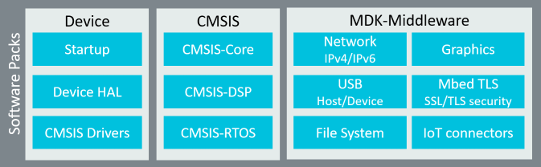
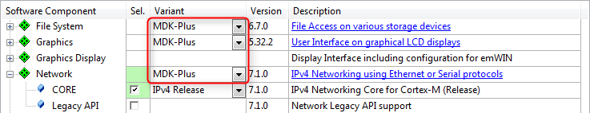
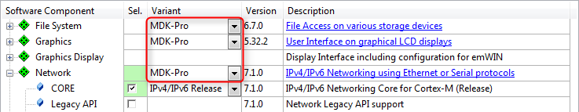
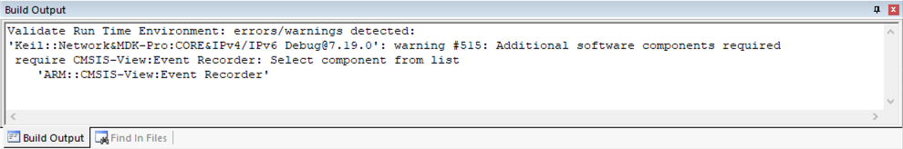
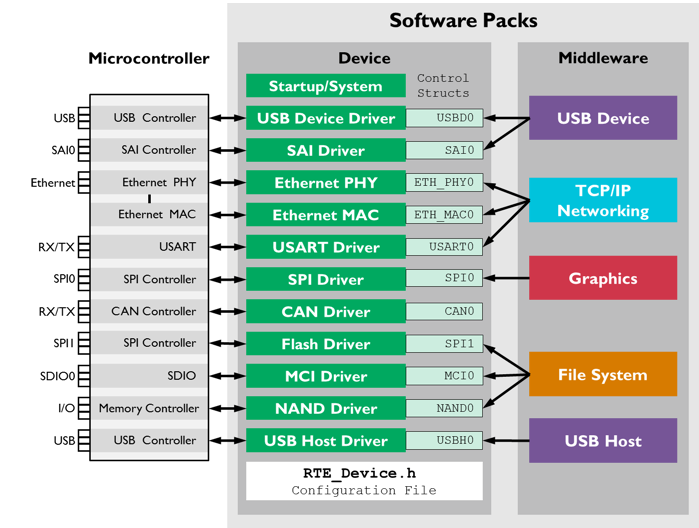

# Overview {#mainpage}

\url{MDK} is a development environment for Arm Cortex-M series microcontrollers which contains everything for creating and testing applications in assembly, C or C++. MDK is split into \url{MDK-Core} and \url{SW-Pack} making new device support and middleware updates independent from the tools.

The **MDK-Middleware** software pack contains components for IPv4 and IPv6 networking, USB Host and Device communication, file system for data storage, and a graphical user interface. The real-time operating system Keil RTX5 is used by all middleware components for task scheduling.

This documentation describes:

 - \url{MW-FileSystem}: create, save, read, and modify files in storage devices such as RAM, Flash, SD/SDHC/MMC memory cards, or USB memory devices.
 - \url{MW-Graphics}: create flexible graphical user interfaces (GUIs) for LCD displays (separately available in the \urlout{Keil-Graphics-Pack} software pack).
 - \url{MW-Network}: services, protocol sockets, and physical communication interfaces for creating networking applications.
 - \url{MW-USB}: create USB Device and USB Host applications with standard USB device classes.
 - \url{MW-Board}: describes the board support interfaces that are used by the various example programs.

Software components outside the scope of this documentation are:

 - \urlout{CMSIS-RTX5}: the real-time operating system used by all middleware components. RTX is available as part of the \urlout{ARM-SW-Pack} software pack.
 - \urlout{mbedTLS}: a software component providing encryption and secure communication for network components. mbed TLS is available as a separate \urlout{mbedTLS-Pack} software pack.

Each component is configurable for a wide range of applications and requires the \ref DriverInterface "driver interface" as described by the \urlout{CMSIS-Driver} standard.

> **Note**
> - Before using MDK-Middleware, please make sure that your selected microcontroller device offers CMSIS-Driver support.

## MDK Editions {#gen_mdk_editions}

MDK-Middleware is available to all users of \urlout{MDK-Pro-Editions} and \urlout{MDK-Plus-Editions}. The following table shows the differences in middleware component availability:

| Middleware Component | MDK-Professional | MDK-Plus  |
|----------------------|:----------------:|:---------:|
| File System          | Available        | Available |
| Graphics             | Available        | Available |
| Network (IPv4)       | Available        | Available |
| Network (IPv4/IPv6)  | Available        |           |
| Network (SSL/TLS)    | Available        |           |
| USB Device           | Available        | Available |
| USB Host             | Available        |           |

## Middleware Component Selection {#gen_mw_component_select}

To add the MDK-Middleware components to your project, you need to select the proper MDK edition in the **Manage Run-Time Environment** window.

Using **MDK-Plus**, select:

Using **MDK-Professional**, select:

> **Note**
> - If you have an MDK-Plus license installed, but select **MDK-Pro**, you will get an error at compile time.

## Supported toolchains {#gen_supported_toolchains}

MDK-Middleware libraries are verified to work in &mu;Vision projects with the target toolchain set to default Arm Compiler 5 or Arm Compiler 6 versions included in the MDK installer.

> **Note**
> - When using Arm Compiler 6 with Link-Time Optimization (LTO) enabled, linker errors and warnings might be issued for some symbols in the MDK-Middleware libraries due to known limitations in the toolchain. In such cases the LTO option should not be used.

## Migrating to CMSIS v6 {#migrating_cmsis_v6}

Starting from version v7.17.0, the MDK-Middleware uses software components from the new CMSIS-Packs **ARM:CMSIS-View** and **ARM:CMSIS-Compiler**. They replace the previous pack **Keil:ARM_Compiler** with its components. Opening middleware projects and updating to the latest MDK-Middleware, you might see the following messages in the Build Output window:

In the Manage Run-Time Environment window you will see similar messages:

Refer to the [project migration guide](https://learn.arm.com/learning-paths/microcontrollers/project-migration-cmsis-v6/troubleshooting/) on how to migrate these components to the new ones.

> **Note**
> - Component migration is not mandatory and you can continue using the old components. In that case,
you need to ignore the validation and build output messages.

\page DriverInterface Driver Interface

The interface to the microcontroller peripherals is done using drivers complying with the \urlout{CMSIS-Driver} standard. These drivers are not limited to MDK-Middleware and may be used by other middleware stacks to utilize the peripherals.

For each enabled peripheral of the microcontroller, a control or access struct is provided that is the interface for the middleware. Drivers for most of the communication peripherals are part of a \urlout{SW-Pack} that provides device support.

The drivers are typically configured using the RTE_device.h configuration file. This file maps I/O pins, interrupts and DMA channels to the available microcontroller resources. Silicon vendors may supply their own configuration tools for peripheral access (for example, \urlout{DAVE} or \urlout{STM32Cube}).

The access struct of the various drivers is connected to the middleware using the configuration files of each middleware component.

\page mw_using_mw Middleware Documentation

This user's guide contains the following chapters:
 - \subpage mw_using_generic_steps explains the necessary steps to create from scratch a project containing a Middleware component.
 - \subpage mw_using_stack_and_heap describes how to configure a project to meet the resource requirements of the Middleware.

Every middleware component has a section on the following topics to explain how to create an application:
 - **Create an Application** contains step-by-step instructions for using the components in an embedded application.
 - **Example projects** outline key product features of the software components. They are tested, implemented, and proven on several evaluation boards and can be used as a starting point for application development.
 - **Resource Requirements** state the stack, thread and memory resource requirements for every component.
 - **Reference** documents the files of a component and each API function.

The following table gives you links to the respective sections of each middleware component:

\anchor doc_mw
<table class="doxtable">
  <tr>
    <th>Topic</th>
    <th colspan="5">Links to Documentation</th>
  </tr>
  <tr>
    <td><b>Create an Application</b></td>
    <td><a href="../FileSystem/fs_create_app.html"><b>File System</b></a></td>
    <td><a href="https://www.keil.com/pack/doc/mw/Graphics/html/gui_gs_dialog.html"><b>Graphics</b></a></td>
    <td><a href="../Network/network_create_app.html"><b>Network</b></a></td>
    <td><a href="../USB/_u_s_b__device.html#Creation_Steps"><b>USB Device</b></a></td>
    <td><a href="../USB/_u_s_b__host.html#Create_a_USB_Host_Application"><b>USB Host</b></a></td>
  </tr>
  <tr>
    <td><b>Example projects</b></td>
    <td><a href="../FileSystem/html/fs_examples.html"><b>File System</b></a></td>
    <td></td>
    <td><a href="../Network/nw_examples.html"><b>Network</b></a></td>
    <td><a href="../USB/_u_s_b__device__tutorial.html"><b>USB Device</b></a></td>
    <td><a href="../USB/_u_s_b__host__tutorial.html"><b>USB Host</b></a></td>
  </tr>
  <tr>
    <td><b>Resource Requirements</b></td>
    <td><a href="../FileSystem/fs_resource_requirements.html"><b>File System</b></a></td>
    <td><a href="https://www.keil.com/pack/doc/mw/Graphics/html/graphic_resource_requirements.html"><b>Graphics</b></a></td>
    <td><a href="../Network/nw_resource_requirements.html"><b>Network</b></a></td>
    <td colspan="2" align="center"><a href="../../USB/html/usb_resource_requirements.html"><b>USB</b></a></td>
  </tr>
  <tr>
    <td><b>Reference</b></td>
    <td><a href="../FileSystem/modules.html"><b>File System</b></a></td>
    <td><a href="https://www.keil.com/pack/doc/mw/Graphics/html/gui_documentation.html"><b>Graphics</b></a></td>
    <td><a href="../Network/modules.html"><b>Network</b></a></td>
    <td colspan="2" align="center"><a href="../USB/modules.html"><b>USB</b></a></td>
  </tr>
</table>