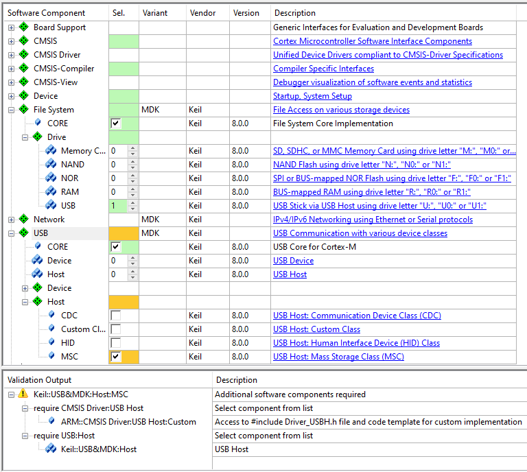
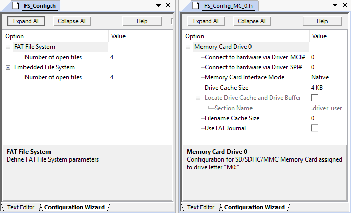
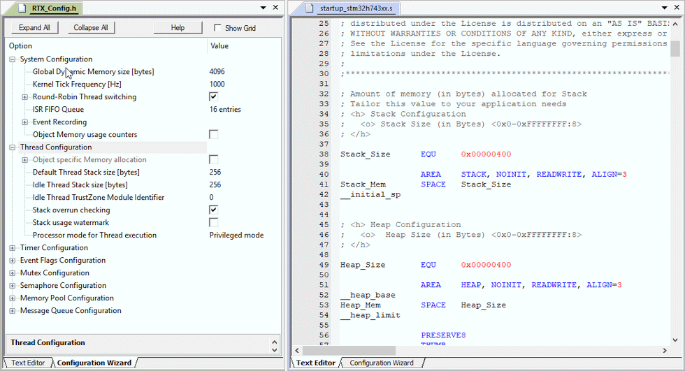

# Using Middleware {#mw_using}

## Driver Interface {#DriverInterface}

The interface to the microcontroller peripherals is done using drivers complying with the \urlout{CMSIS-Driver} standard. These drivers are not limited to MDK-Middleware and may be used by other middleware stacks to utilize the peripherals.

For each enabled peripheral of the microcontroller, a control or access struct is provided that is the interface for the middleware. Drivers for most of the communication peripherals are part of a \urlout{SW-Pack} that provides device support.

The drivers are typically configured using the RTE_device.h configuration file. This file maps I/O pins, interrupts and DMA channels to the available microcontroller resources. Silicon vendors may supply their own configuration tools for peripheral access (for example, \urlout{STM32Cube} or \urlout{MCUXpresso}).

The access struct of the various drivers is connected to the middleware using the configuration files of each middleware component.

## Generic Steps {#mw_using_generic_steps}

There are a few generic steps that have to be done to include a middleware component in a project:

- \ref add_sw_comp : Select the required middleware components for your application in your component manager.
- \ref conf_mw : Adjust the parameters of the middleware components in their related configuration files.
- \ref conf_drivers : Configure the peripheral interfaces that connect the middleware components with physical I/O pins of the device.
- \ref conf_sys_req : Configure RTOS, memory, and stack resources to the requirements of the middleware components.
- \ref implement_feat : Use the API functions of the middleware components to implement the application specific behavior. Code templates help you create the related source code.

### Add Software Components {#add_sw_comp}

Using the **CMSIS Component Manager** window, you need to select the required software components for your application. The **Validation Output** helps you to identify dependencies to other software components and resolves them automatically, whenever possible.

### Configure Middleware {#conf_mw}

Every middleware component has specific configuration files that need to be adapted to the needs of the application. Depending on the component, more than one file might need to be adapted. For example, the **File System** component needs to be configured for the amount of files that can be opened simultaneously.

In addition, you need to set drive specific settings in the <b>FS_Config_<i>Drive</i>_0.h</b> file, such as page and block sizes
for Flash memories, general disk sizes for a RAM drive, and the hardware driver number for connecting the drive to the appropriate hardware peripheral driver.

### Configure Drivers {#conf_drivers}

Usually, the device driver related to a software component and the associated controller in the microcontroller need to be configured as well. For the middleware, this is usually done in the file **RTE_Device.h**. Here, you can enable or disable the different hardware controllers and you can specify which device pins are used for the different features of a specific device peripheral.

### Configure System Resources {#conf_sys_req}

Every software component has resource requirements for stack, heap, and memory. Configuration files such as
<b>startup_<i>device</i>.s</b> and \urlout{RTX-Conf-CM5} file need to be adapted to these requirements. Every middleware component has a section that explains the resource requirements and gives examples on how to calculate the resulting values for adaption of the configuration files. The section \ref mw_using_stack_and_heap gives you more information about the background and the configuration files that need to be touched.

### Implement Application Features {#implement_feat}

Finally, the actual application needs to be implemented. For better understanding of the middleware components, take a look at the existing \ref doc_mw "Example projects". They can be used as a starting point for application development. The \ref doc_mw "Reference" sections of each middleware component help to understand the API functions for the related components. Various \urlout{uv4_ca_sourcefiles} are available to help you implementing your application.

## Stack, Heap and RTOS Configuration {#mw_using_stack_and_heap}

Every software component has resource requirements for stack, heap, and memory. Configuration files such as \ref mw_using_startup "startup_device.s" and \ref mw_using_rtx_conf "RTX_Config.h" need to be adapted to these requirements. Every middleware component has a section that explains the resource requirements and gives examples on how to calculate the resulting values for adaption of the configuration files.

### Configuring Stack using startup_device.s {#mw_using_startup}

The **startup_device.s** file is provided by the device vendor in a [Device Family Pack](https://open-cmsis-pack.github.io/Open-CMSIS-Pack-Spec/main/html/index.html).

The file will be copied into a project automatically after selecting **Device:Startup** in the **Manage Run-Time Environment** window. It is used to configure the size of the stack that is used by exceptions and **interrupt service routines (ISR)** for the current project. The stack size requirements depend on the maximum nesting of exception and ISR execution and therefore on the priority settings of the various interrupt and exception sources. Also, the heap which is used by memory allocation functions is configured in this file.

Most of the middleware components only require additional **stack** size, whereas the **File System** component also
requires additional **heap** size. The memory requirements are stated in the \ref mw_using_mw "Resource Requirements" section
of each middleware component.

### Configuring CMSIS-RTOS2 using RTX_Config.h {#mw_using_rtx_conf}

The stack size in the **startup_device.s** file configures only the stack space that is used by exceptions and **interrupt service routines (ISR)**. When using a CMSIS-RTOS2, additional requirements for the RTOS are configured in the \urlout{RTX-Conf-CM5} file. In general middleware components use statically allocated resources when RTX v5 is used and in that case  no change to RTX configuration file is necessary, for details consult Resource Requirements section of related component.

The additional CMSIS-RTOS related requirements are also stated in the \ref mw_using_mw "Resource Requirements" section
of each middleware component.
